<h1 align="center">Projet Santoline</h1>

## Table of Contents

- [Mise en route](#mise-en-route)
  - [Architecture](#architecture)
  - [Dépendances](#dépendances)
  - [Installation](#installation)
- [Guide d'utilisation](#guide-dutilisation)
- [Authors](#authors)

---

## Mise en route

Heuresement pour vous, nous avons ENORMEMENT simplifier le processus de déploiement de NewSantoline. Malgré tout, il reste quelques subtilités, mais si vous suivez ce guide tout ce passera bien et vite.

Dans un premier temps, vous devez cloner le projet.
Pour ce faire placez vous dans le répertoire de destination (de préférence __C:/Users/\<username\>__) et exécutez la commande:

```git
git clone https://github.com/hbollon/NewSantoline.git
```

### Architecture

Voici un schéma expliquant l'architecture de ce projet, afin de bien comprendre quels sont les différents éléments :

[schéma](doc/schema.pdf)

### Dépendances

Il faut installer les logiciels suivants:

- [QGIS 3.2](https://qgis.org/downloads/)
- [windNinja](https://firelab.org/document/windninja-software)
- [mingw](https://sourceforge.net/projects/mingw/) **(cocher MinGW Base System/Autotools/g++)**
- [cmake](https://cmake.org/download/) -> faire attention à ce que cmake soit ajouter dans le path

Bien faire attention à laisser les chemins par défaut de ces applications lors de l'installation (notre application ira directement récuperer leur chemin) :

- WindNinja : racine de C: (__C:\WindNinja\WindNinja-x.x.x__)
- Qgis : dans ProgramFiles (__C:\Program Files\QGIS 3.2__)

Assurez-vous que cmake et mingw ont bien été ajouté dans la variable environement "Path" (voir [ce lien](https://www.architectryan.com/2018/03/17/add-to-the-path-on-windows-10/) si vous ne savez pas comment interragir avec vos variables d'environnement).

### Installation

- Télécharger les données des départements (carte et données altimétriques) et décompressez l'archive dans le répertoire:
  
```batch
C:\Users\<username>\NewSantoline\data\altimetrics
```

- Lancer le script **build.bat** dans le dossier **Scripts** : qui permet de build automatiquement tout les sous-programmes C++ (en cas de soucis vérifiez que vos installation de cmake/mingw sont valides)
- Lancer le fichier **run.bat**

## Guide d'utilisation

### 1. Choix du département

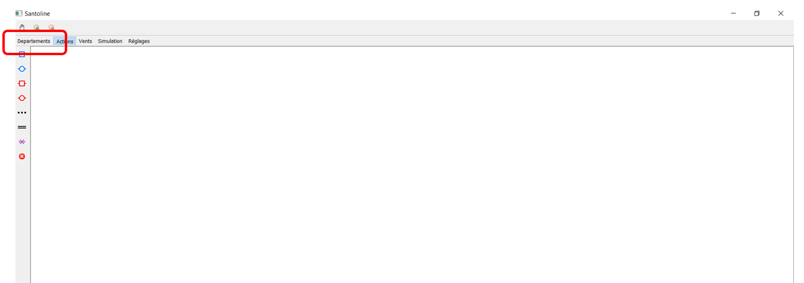
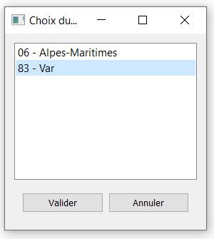

### 2. Carte des Vents

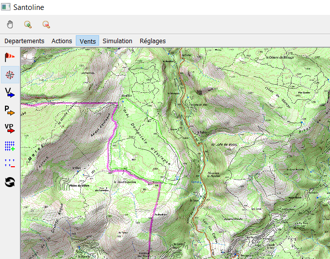

Placez ensuite un point, qui sera le centre de la carte des vents représenté par une étoile noire.

Pour ce faire, cliquez sur le deuxième bouton du menu **Vents** et cliquez ensuite là où vous voulez le placer sur la map.
Une fois le point placé, appuyer sur l'icône du drapeau.

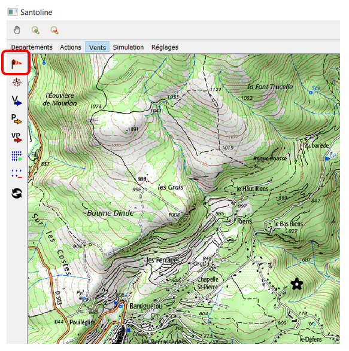

Sélectionner les paramètres souhaités, à noter que :

- la zone est carrée de taille ("distance" x "distance"), _ex : ici zone de 1000 par 1000_
- orientation du vent : voir la chose comme une boussole

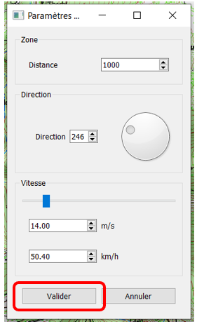

En fonction des performances sur votre PC, ce calcul peut être plus ou moins long, prendre le temps de regarder la console ouverte en parallèle pour voir si des problèmes ont été rencontrés. Voici un exemple de ce que vous devriez obtenir, si tout s'est bien passé :


Pour afficher la carte des vents, il vous suffit d'appuyer sur le bouton "V" dans l'onglet "Vents".

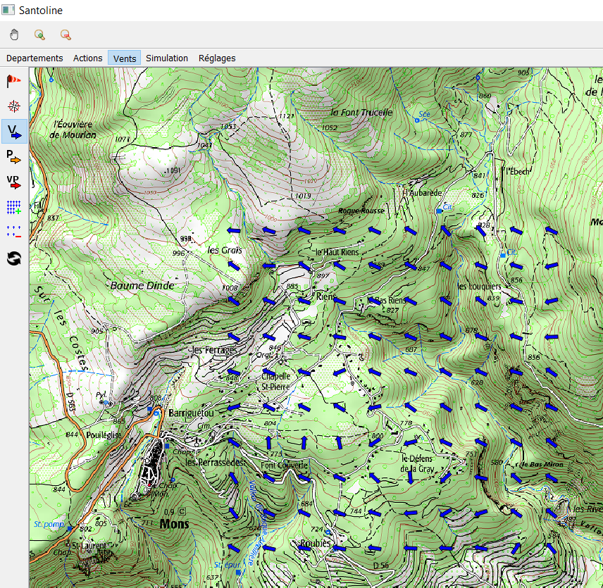

Voici un résultat final que vous devriez obtenir.

### 3. Simulation des contours de feu

Après avoir calculer les vents, l'étape qui suit est de réaliser une simulation pour calculer le contour des vents :

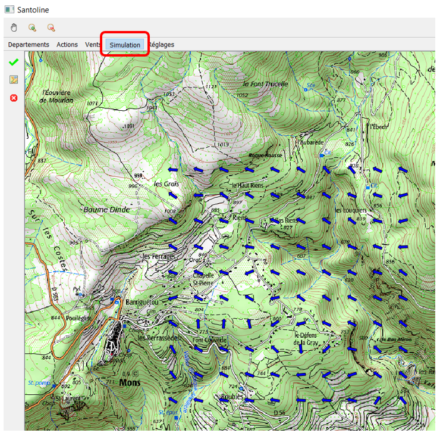

Appuyer sur le bouton "Dessiner contours" :

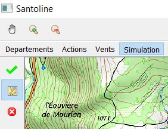

Dessinez ensuite le contour, chaque clic que vous faites **(ATTENTION LES POINTS QUE VOUS DEVEZ PLACER DOIVENT ETRE DANS LA ZONE DES VENTS)** est un point, et le clic d'après reliera le point précédent avec celui que vous venez de faire, pour alors tracer des segments :

- **Etape 1 :**

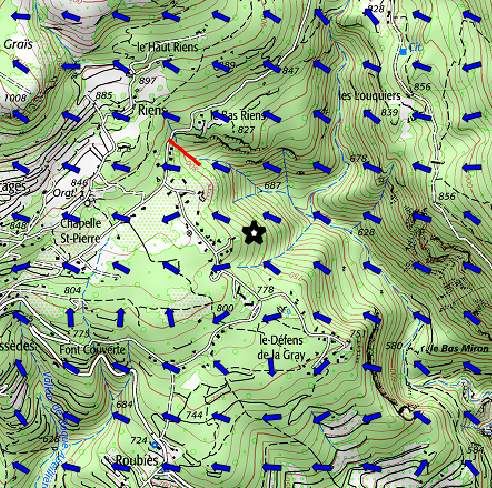

- **Etape 2 :**
  
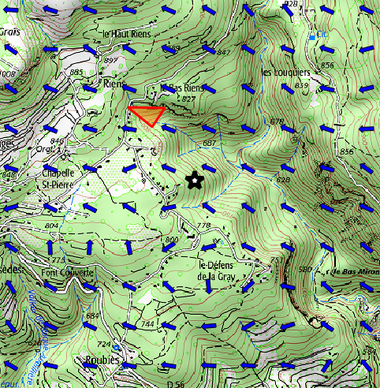

- **Etape 3 :**
  
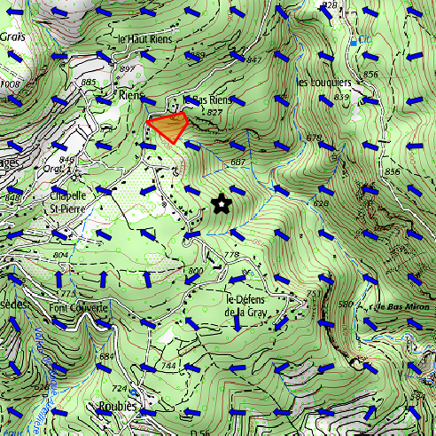

Continuez ainsi jusqu'à ce que le contour initial soit suffisamment précis. Il est important de noter que chaque segment que vous faites, augmente le temps de calcul final de la simulation.

Si vous commetez une erreur sur le contour, il est possible d'effacer le contour en cours en appuyant sur la croix rouge :

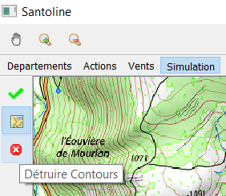

Une fois le contour realisé, il vous suffira de lancer la simulation (en renseignant d'abord les paramètres de cette dernière) :

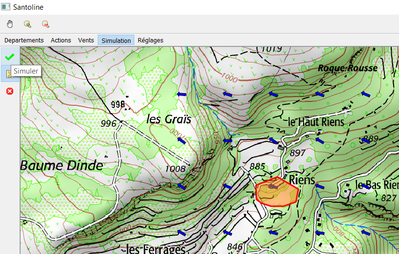

Quelques petites informations sur les arguments de la simulation :

- Saisir dans le champ "Algorithme", le numéro de l'algorithme que vous voulez utiliser : 2 ou 3 (pour l'instant)
- Durée de propagation : temps de propagation, si vous dépassez 1h30, les temps de calcul risquent d'être longs


Appuyer sur "Valider" et attendez maintenant que la simulation se finisse, en consultant la console pour voir si tout s'est bien passé. Voici un exemple de ce à quoi pourrait ressembler votre console.

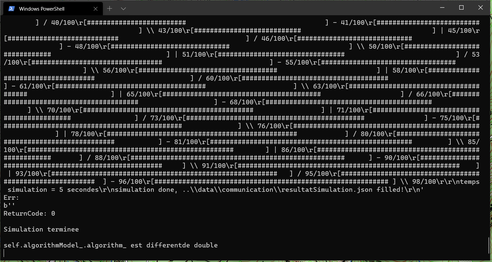

Et voici un exemple du résultat final, après que la simulation soit terminée.

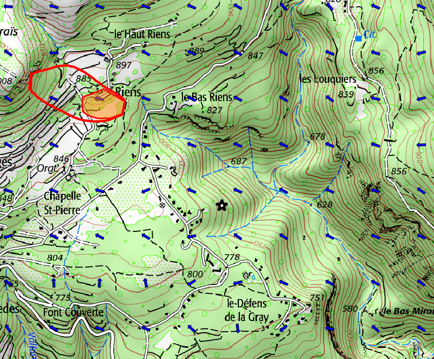

**Vous pouvez modifier les paramètres _deep_ de NewSantoline depuis l'onglet _Réglages_. Notament le nombre de segments et le l'angle des propagations pour les algorithmes 1 et 2. Ces deux paramètres influent la précision du tracé final ainsi que la vitesse de la simuation**

## Authors

👤 **Hugo Bollon**

- Github: [@hbollon](https://github.com/hbollon)
- LinkedIn: [@Hugo Bollon](https://www.linkedin.com/in/hugobollon/)
- Portfolio: [hugobollon.me](https://www.hugobollon.me)

👤 **Samuel Rodriguez-Lozano**

👤 **Laurent Cutting**

👤 **Hamza Mahri**

## Show your support

Give a ⭐️ if this project helped you!
